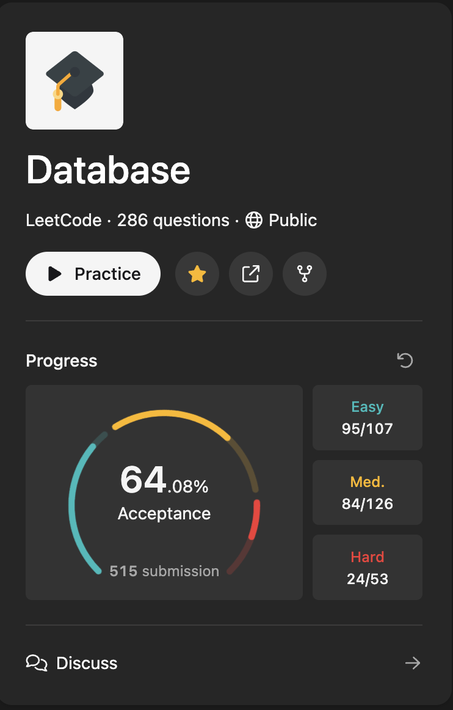

## 🤓 LeetCode Solutions Repository

Welcome to my LeetCode Solutions repository! Here, you'll find my solutions to various LeetCode problems. I have been consistently practicing algorithms and problem-solving skills, and this repository showcases my progress and solutions.

---

## 🫡 About Me

I am a passionate software engineer who enjoys solving complex problems and improving coding skills through challenges. LeetCode has been a major platform for me to practice a wide range of data structures and algorithms.

Feel free to explore the solutions provided below!

---

## 📢 Join My Telegram Channel

Stay updated and join the conversation: [Telegram Channel](https://t.me/mensenvau)

---
